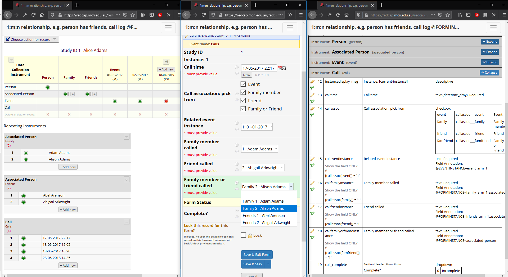

# REDCap External Module: Instance Select

`@FORMINSTANCE`, `@EVENTINSTANCE` and `@RECORDINSTANCE` action tags for use with unvalidated text fields that enable you to select a specific instance of a repeating form or event for the current record, or another record from the project.

When the data entry or survey page loads, a tagged text field will be replaced with a select list with options for each instance of the specified form / event for the current record, or project records.

## Action Tags

### `@FORMINSTANCE`

Specify a form name or unique event name/form name pair and the select list will show instances of the specified form for the current record:

* `@FORMINSTANCE=myformname` : Select an instance of `myformname` from all events in which it is designated
* `@FORMINSTANCE=myevent_arm_1:myformname` : Select an instance of `myformname` from the `myevent_arm_1` event only

If the (event/)form is not a repeating form then the action tag will be ignored and you will see only the unvalidated text field.

### `@EVENTINSTANCE`

Specify the unique event name of a repeating event and the select list will show instances of the specified event for the current record:

* `@EVENTINSTANCE=myeventname_arm_n` : Select an instance of repeating event `myeventname_arm_n`

If the event is not a repeating event then the action tag will be ignored and you will see only the unvalidated text field.

### `@RECORDINSTANCE`

Select another record from the current project. A comma-separated list of arm numbers may be specified, if desired:

* `@RECORDINSTANCE` : Select a record from the current arm
* `@RECORDINSTANCE='2,3'` or,
* `@RECORDINSTANCE=2,3` : Select a record from arm 2 and arm 3 records

Invalid arm numbers will be ignored.

Users assigned to a DAG will see only records assigned to the same DAG.

## Custom Labels

If a custom record label, custom event labels and/or repeat instance labels are configured for the project then the select lists will display instances labelled accordingly.

Where no labels are configured you will see just the record id or instance reference (see note about instance references below).

### `@RECORDINSTANCE` in a Survey

When using `@RECORDINSTANCE` in a survey, records will not be labelled using the project's custom record label - only record ids will be displayed in the select list. This is to guard against participant-identifying data (PHI) that might be included within custom record labels from being displayed to other participants.

## Saved Data

In general the data saved to the tagged field will be simply a record id or instance number. Sometimes, however, this will not be sufficient to unambiguously identify a single record or form instance. Examples are:
* `@RECORDINSTANCE` not specifying a single arm in a project with multiple arms 
* `@FORMINSTANCE` specified with a form that is repeating in more than one event

In these cases the select list values, and hence saved data values, will use the following colon-separated patterns:

* `@RECORDINSTANCE` `arm num:record id` e.g. 2:1001
* `@FORMINSTANCE` `event ref:form instance number` e.g. event_1_arm_1:4

It is these saved values that will appear in reports and exports. Values will not be labelled with custom record, event or instance labels.

## Example 
This example shows a project illustrating the @EVENTINSTANCE and @FORMINSTANCE action tags. The project records are individuals that have a number associated people: "family" (recorded on the "Associated Person" form in the "Family" event) and "friends" (recorded on the "Associated Person" form in the "Friends" event). There is also a repeating event with an event form. Calls associated with the people or events are recorded in the "Call" form of the "Calls" event. The following action tag usage is illustrated:
* Field calleventinstance; `@EVENTINSTANCE=event_1_arm_1`
  Select an instance of the repeating `event_1_arm_1` event. 
* Field callfamilyinstance; `@FORMINSTANCE=family_arm_1:associated_person`
  Select an instance of the a family member from the "Family" event.
* Field callfriendinstance; `@FORMINSTANCE=friend_arm_1:associated_person`
  Select an instance of the a friend from the "Friends" event.
* Field callfamilyorfriendinstance; `@FORMINSTANCE=associated_person`
  Select an instance of the "Associated Person" form from any event - either "Family" or "Friends".

